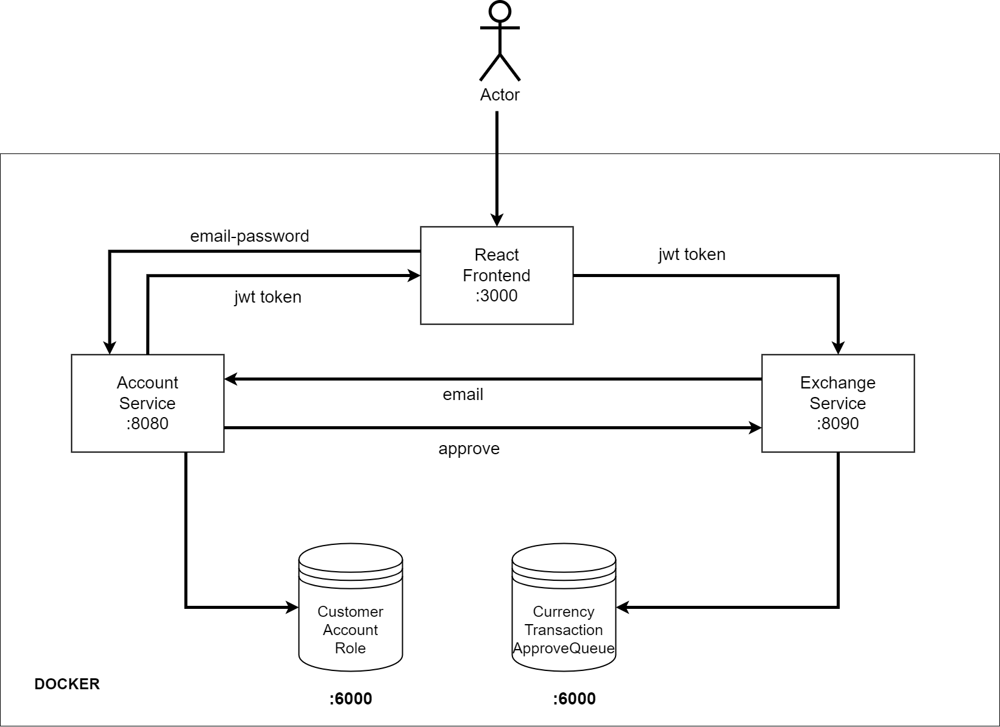

# Trade Master App


### Tech Stack

----

* Java 17
* Spring Boot 2.7.3
* Spring Data Jpa
* Bearer Authentication with JWT
* PostgreSQL
* React Js - Axios
* Docker

<br>

### How It Works

---
<br>



<br>
<br>

1. Run command below on Account and Exchange Api


 ```shell
mvn clean install
```
<br>
<br>

2. Run this command on docker-compose.yml folder directory.

 ```shell
docker-compose up
```

<br>
<br>

3. Credentials

- User 1 : info@tom.net   password: 12345
- User 2 : info@jerry.net password: 12345

<br>
<br>

4. All done.


